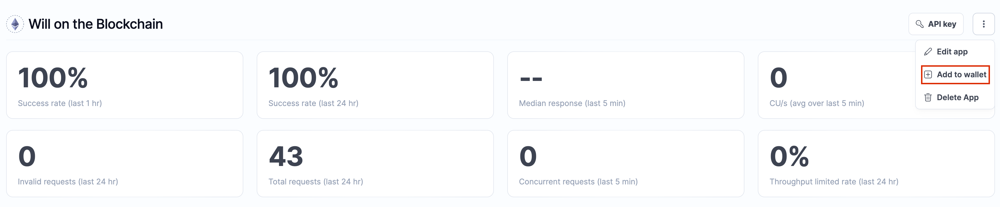
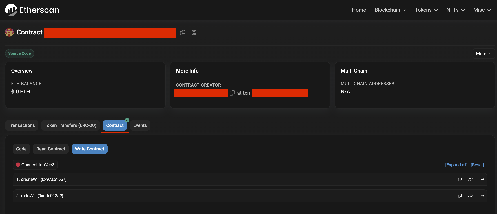

# Will Storage on Blockchain

## Overview

This project is designed to enable the secure storage of wills on a blockchain using Solidity and the Hardhat development environment. It offers a decentralized and tamper-resistant solution for individuals to store their wills, ensuring that the information remains immutable and accessible.

## Table of Contents

- [Will Storage on Blockchain](#will-storage-on-blockchain)
  - [Overview](#overview)
  - [Table of Contents](#table-of-contents)
  - [Prerequisites](#prerequisites)
  - [Getting Started](#getting-started)

## Prerequisites

Before you start, make sure you have the following prerequisites installed on your system:

- Node.js and npm
- Hardhat: A development environment for Ethereum smart contracts
- A development Ethereum network (e.g., Hardhat Network, Ganache)
- MetaMask or a similar Ethereum wallet

## Getting Started

1. Clone this repository to your local machine:

```bash
git clone https://github.com/your-username/will-storage-on-blockchain.git
```

2. Install dependencies

```bash
npm install
```

3. Setup harhat.config file
   1. Go to [Alchemy](https://dashboard.alchemy.com/") create a new App, select your test network and copy the RPC endpoint
   2. Add testnet to your metamask 
   3. Add selected testnet ETH to your metamask (e.g. If you select Sepolia testnet you can grabe some [here](https://sepoliafaucet.com/))
   4. Create a `.env` file following the structure of the `.env.example` and change the values according to the testnet that you used in the steps before (don't forget to change `[YOUR_TESTNET]` placeholder :))
   5. Change `hardhat.config.ts` file in order to use the values of .env file that you just created
4. Create a Etherscan [API KEY](https://docs.etherscan.io/getting-started/viewing-api-usage-statistics) so you can verify the contract after the deploy process. After that update the .env file with that api key.

5. Run scrips to deploy and verify the contract

```bash
npx hardhat deploy --network <your-testnet>  # deploy the contract
```

```bash
npx hardhat --network <your-testnet> etherscan-verify # verifies the contract
```

6. Grab the address of the contract that it's displayed if the contract was sucessfully verified, go to your testnet etherscan and paste the address on the search bar and begin engaging with the contract :) 

> **NOTE**  
> Additional documentation, including detailed usage instructions, and deployment guides, will be added to this repository in the near future. I will try to actively enhancing the documentation to make it more user-friendly and informative. In the meantime, if you have any questions or sugestions, please feel free to reach out to me by creating an issue in this repository or contacting me at mj.viana1993@hotmail.com.
